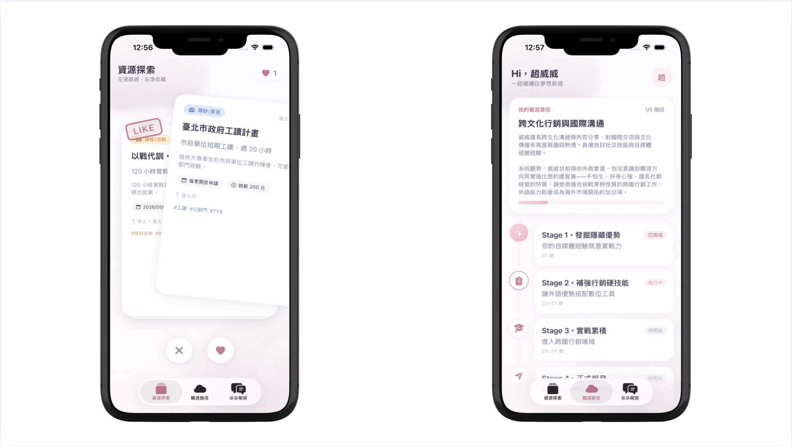
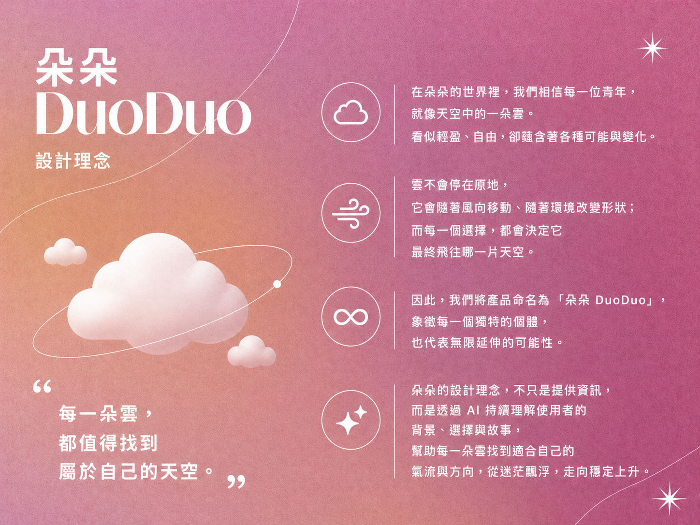
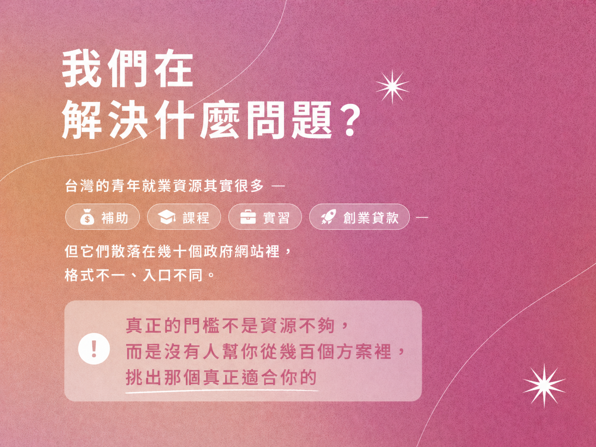
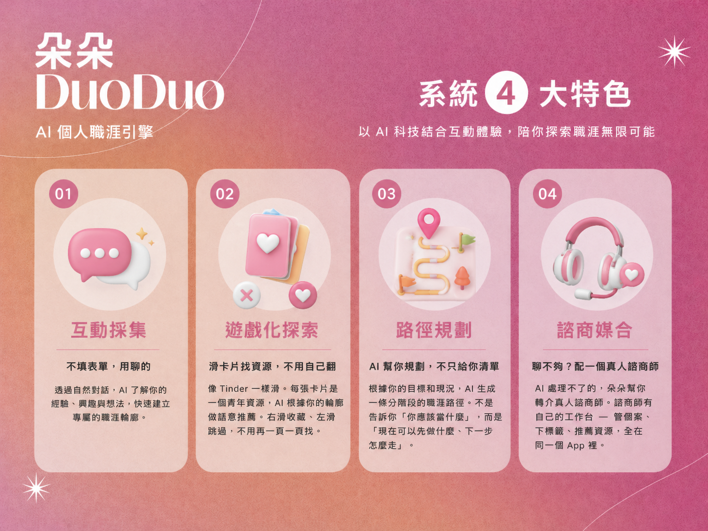
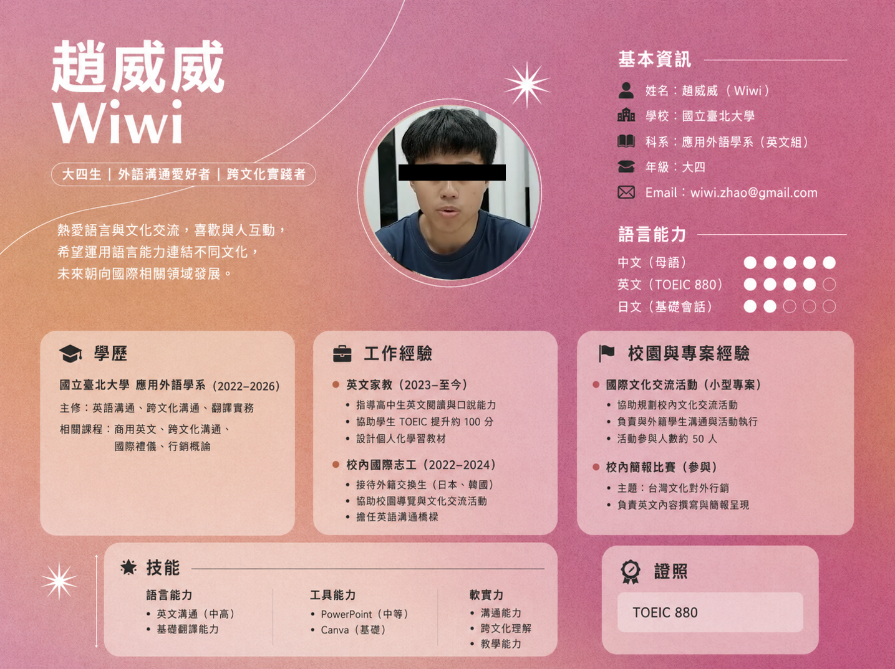
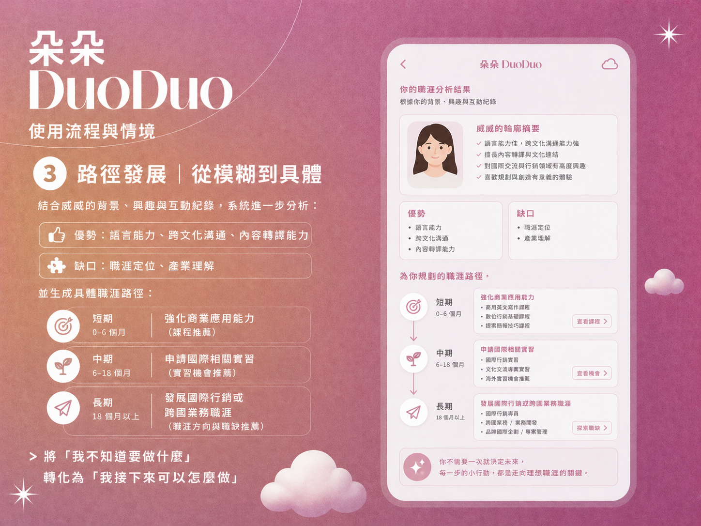
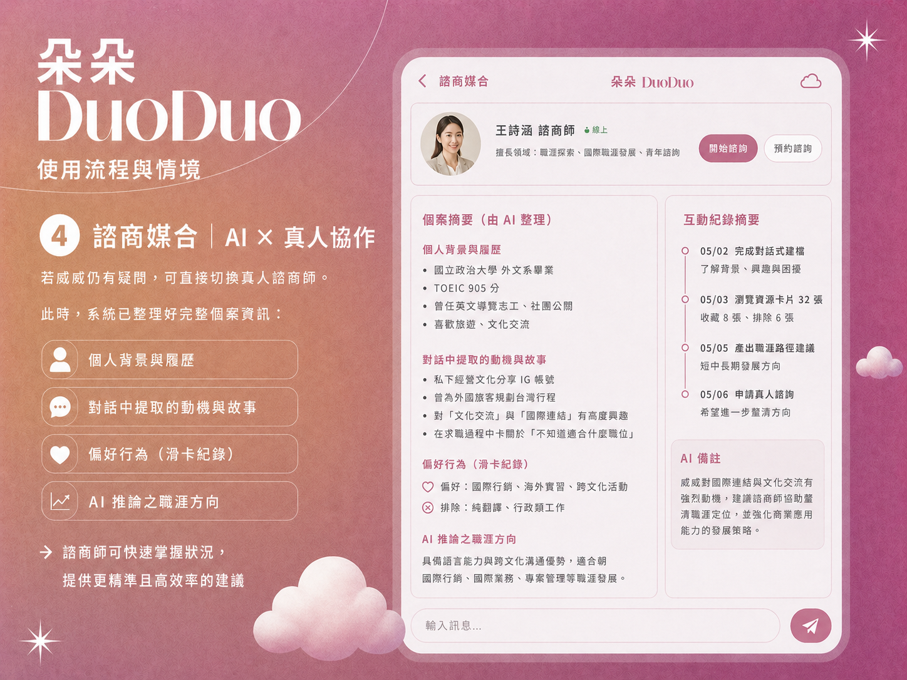

<h1 >朵朵 DuoDuo ☁️</h1>


賽題分類：賽題 B · 行穩台北<br>
團隊：第 11 隊「哎你個碼」

## 30 秒看懂這個專案
[demo影片](slides/key.png)
<!--  -->
我們做了一個遊戲化互動式AI 職涯導航APP給迷惘的青年使用，
解決履歷無法呈現個人潛力、資源難以精準媒合的問題。

主要功能
AI 人物建模：透過對話挖掘履歷之外的個人故事與特質
滑卡式資源推薦：用直覺操作快速建立偏好模型
職涯路徑生成：將模糊目標轉為可執行的成長路徑
職涯諮商媒合：配對諮商師並針對諮商師管理需求進行優化設計 


## 朵朵的設計理念

在朵朵的世界裡，**我們相信每一位青年，就像天空中的一朵雲。**
看似輕盈、自由，卻蘊含著各種可能與變化。

雲不會停在原地，它會隨著風向移動、隨著環境改變形狀；
而每一個選擇，都會決定它最終飛往哪一片天空。

因此，我們將產品命名為「朵朵 DuoDuo」，
象徵**每一個獨特的個體，也代表無限延伸的可能性。**

朵朵的設計理念，不只是提供資訊，
而是透過 AI 持續理解使用者的背景、選擇與故事，
幫助每一朵雲找到適合自己的氣流與方向，
從迷茫飄浮，走向穩定上升。

<video src="demo.mp4" controls width="600"></video>


## 我們在解決什麼問題？

台灣的青年就業資源其實很多 — 補助、課程、實習、創業貸款 — 但它們散落在幾十個政府網站裡，格式不一、入口不同。

真正的門檻不是資源不夠，而是**沒有人幫你從幾百個方案裡，挑出那個真正適合你的。**


## 朵朵怎麼做？


### 不填表單，用聊的
透過AI問答，問出簡歷中無法展現的故事、個人特質


### 滑卡片找資源，不用自己翻
像 Tinder 一樣滑。每張卡片是一個青年資源，AI 根據你的輪廓做語意推薦。右滑收藏、左滑跳過，不用再一頁一頁找。


### AI 幫你規劃，不只給你清單
根據你的目標和現況，AI 生成一條分階段的職涯路徑。不是告訴你「你應該當什麼」，而是「現在可以先做什麼、下一步怎麼走」。


### 聊不夠？配一個真人諮商師
AI 處理不了的，朵朵幫你轉介真人諮商師。諮商師有自己的工作台 — 管個案、下標籤、推薦資源，全在同一個 App 裡。


---

## 系統架構

```
 ┌───────────────────────────────────────────────────────────────────┐
 │  iOS App (SwiftUI)                                                │
 │  登入 → AI 對話建模 → 資源滑卡 → 職涯路徑 → 諮商配對                    │
 └───────────────────────────┬───────────────────────────────────────┘
                             │ HTTPS
 ┌───────────────────────────▼───────────────────────────────────────┐
 │                                                                   │
 │  ┌─────────────────────────────────────┐   ┌───────────────────┐  │
 │  │  FastAPI Backend                    │   │  Crawler          │  │
 │  │                                     │   │                   │  │
 │  │  /landing/chat ── 對話式欄位萃取      │   │  6 個爬蟲          │  │
 │  │  /path/generate ── 職涯路徑生成       │   │  每日自動抓取       │  │
 │  │  /chat/ai ──────── RAG 語意回覆      │   │  ↓                │  │
 │  │  /resources ────── 語意搜尋          │   │  Gemini LLM       │  │
 │  │  ~40 endpoints                      │   │  摘要 + 分類標籤    │  │
 │  │               │                     │   │       │           │  │
 │  └───────────────┼─────────────────────┘   └───────┼───────────┘  │
 │                  │                                  │             │
 │         ┌────────▼──────────────────────────────────▼──────┐      │
 │         │                                                  │      │
 │         │  ┌──────────────────┐   ┌──────────────────┐     │      │
 │         │  │  PostgreSQL 15   │   │  ChromaDB        │     │      │
 │         │  │  15 張表          │   │  向量語意搜尋      │     │      │
 │         │  │  使用者·資源·個案   │   │  Gemini Embedding│     │     │
 │         │  └──────────────────┘   └──────────────────┘     │      │
 │         │                                                  │      │
 │         └──────────────────────────────────────────────────┘      │
 │                                                                   │
 │                        Gemini 2.5 Flash                           │
 │              對話萃取 · Holland 分析 · 路徑生成 · RAG                 │
 │                                                                   │
 └──────────── Docker Compose ──────────────────────────────────────┘
```

| 模組 | 技術 |
|---|---|
| iOS 前端 | SwiftUI · `@Observable` 單一狀態管理 |
| 後端 API | FastAPI · async SQLAlchemy · ~40 endpoints |
| AI 引擎 | Gemini 2.5 Flash · Gemini Embedding · RAG |
| 資料層 | PostgreSQL 15 · ChromaDB 向量資料庫 |
| 資料管線 | 6 個爬蟲自動抓取 + LLM 摘要分類，每日更新 |
| 部署 | Docker Compose（Backend + DB + ChromaDB + Crawler） |

### 資料管線

爬蟲每日自動從多個個台北市青年資源網站抓取最新資料：

| 來源 | 方式 |
|---|---|
| 青年局公告 | Nuxt payload 解析 |
| 創業台北 | HTML 爬取 |
| 青年學院課程 | HTML 爬取 |
| 職涯發展平台 | SPA 靜態內容 |
| 台北市開放資料 | REST API |
| 靜態政策資料 | 手動維護 |

抓取後經 **Gemini LLM 自動生成摘要與分類標籤**，同步寫入 PostgreSQL（結構化查詢）+ ChromaDB（向量語意搜尋）。

### 核心 AI 能力

| 能力 | 說明 |
|---|---|
| 對話式欄位萃取 | 從自然語言中提取年齡、學校、興趣等結構化欄位，不需要使用者填表 |
| Holland 人格分析 | 根據對話內容推斷 Holland 職業興趣類型 |
| 職涯路徑生成 | 結合個人背景，產出分階段的職涯藍圖（含推薦資源） |
| RAG 語意回覆 | 聊天時即時檢索相關資源，回覆中自帶推薦 |
| 複雜度評估 | 自動判斷對話是否需要轉介真人諮商師 |
| 資料摘要enrichment | 爬取的原始資料經 LLM 自動產生標題、摘要、標籤 |

### 使用流程
使用者流程示範｜以「威威」為例

為了讓使用者流程更清楚，我們以一位實際使用者「威威（Wiwi）」作為示範。

威威是國立臺北大學應用外語學系的大四學生，具備良好的語言能力與跨文化溝通經驗。然而，從履歷中只能看出基本背景與經歷，難以判斷其真正的職涯方向與潛在優勢。








## 團隊介紹
### 周佑康
- 角色：前端、功能發想
- 背景：交大資工
- 經歷：Microsoft RD 實習生
- 經歷：Google Data Center 實習生

### 吳盛瑋
- 角色：系統設計、後端開發
- 經歷：Appier Backend 實習生
- 經歷：Brander Digital Marketing 全端工程師
- 經歷：Blockchain Security 區塊鏈工程師

### 趙祖威
- 角色：功能發想、資料佐證與補充
- 經歷：Deloitte Consulting Intern
- 經歷：Taiwan mobile PM Intern
- 經歷：Taipei Metro AI RD Intern

### 林佑亦
- 角色：後端開發、資料庫設計
- 背景：北科大＿資訊財金管理系
- 經歷：MIT CityScience Lab UROP
- 經歷：全國商業技藝競賽＿程式設計職種＿冠軍

---

<p align="center">
  <strong>DouDou 朵朵</strong> — 讓青年不再獨自面對職涯迷霧
</p>
